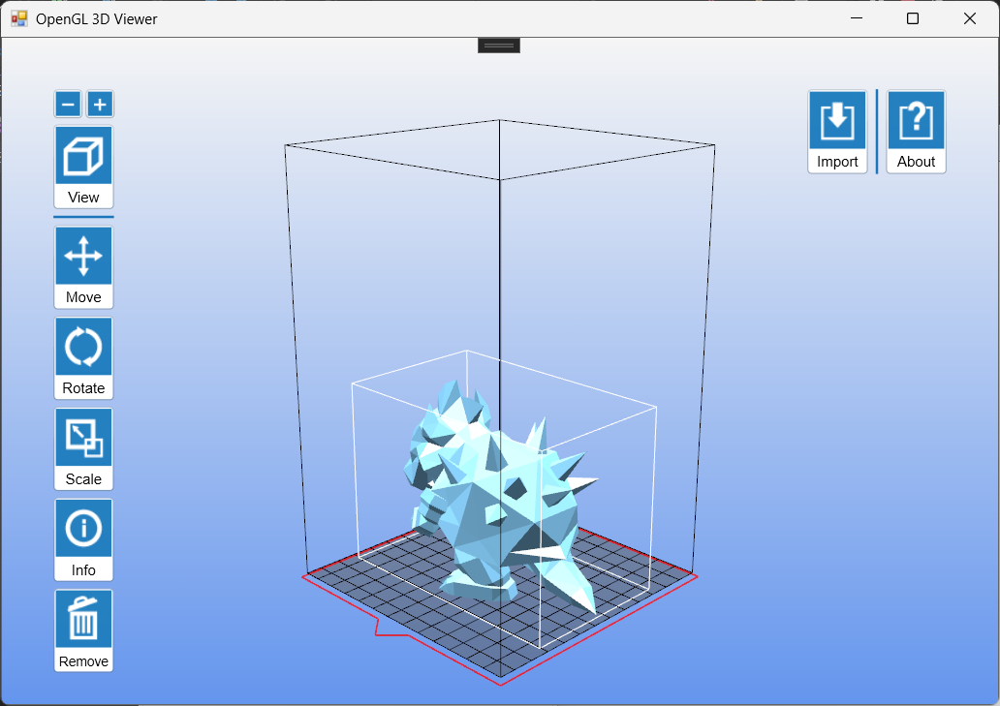

# OpenGL 3D Viwer

This is a simple 3D model viewer built with OpenGL and C#. It allows you to load 3D models in STL format and view them in a 3D environment. 

## Requirements
To run this program, you need to have the following:

- Windows operating system
- Visual Studio 2026  
- C# .Net Framework 4.8.1  
- OpenTK 3.3.3.0

## Installation
To install this program, you can simply clone this repository or download the source code as a ZIP file. Once you have the source code, open the solution file (.sln) in Visual Studio and build the project. This should create an executable file in the bin/debug folder.

## Credits
This program was created by Charles Chang (charles.chang@live.com) as a personal project. It uses the following libraries:

- OpenTK (for OpenGL bindings)

## License
This program is licensed under the MIT License. See the LICENSE file for more information.