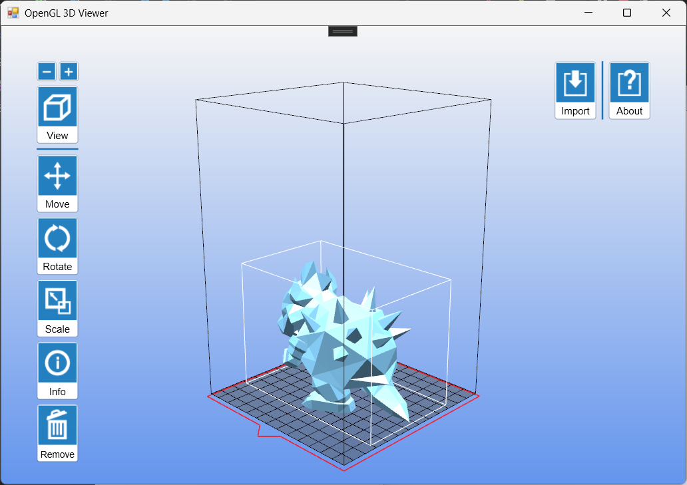

# OpenGL 3D Viwer

A high-performance, lightweight 3D model viewer developed in C# using OpenTK. This project demonstrates the integration of OpenGL within the .NET ecosystem to render and interact with STL geometry.

Features
- STL Support: Efficiently parse and render Binary and ASCII STL files.
- Real-time Interaction: Smooth camera rotation, panning, and zooming.
- Optimized Rendering: Utilizes OpenGL Buffer Objects (VBOs) for hardware-accelerated performance.
- Clean Architecture: Implemented with a focus on SOLID principles and maintainable C# patterns.

## Requirements
To compile this program, you need to have the following:

- Windows operating system
- Visual Studio 2026  
- C# .NET Framework 4.8.1  
- OpenTK 3.3.3.0

## Installation
To install this program, you can simply clone this repository or download the source code as a ZIP file. Once you have the source code, open the solution file (.sln) in Visual Studio and build the project. This should create an executable file in the bin/debug folder.

## Credits
This program was created by Charles Chang (charles.chang@live.com) as a personal project.

- OpenTK: Provides the low-level C# bindings for OpenGL

## License
This program is licensed under the MIT License. See the LICENSE file for more information.